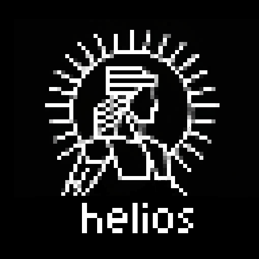

[](https://github.com/thorstensuckow/helios/actions/workflows/tests.yml)

# helios



**helios** is a custom game ~~engine~~ framework built from first principles, written in C++.

## Prerequisites

Before building helios, ensure your system meets the required software prerequisites. See [PREREQUISITES.md](docs/PREREQUISITES.md) for detailed installation instructions for your platform.

**Quick Summary:**
- **CMake** 4.0+
- **C++23-capable compiler** (MSVC 2022, GCC 13+, Clang 17+)
- **OpenGL 4.5+** support
- **Ninja** or **Make** (optional but recommended)

## Quick Start

```bash
# Configure
cmake -S . -B build

# Build
cmake --build build --config Release

# Run an example
cd build/examples/simple_cube_rendering/Release
./simple_cube_rendering
```

## Features

- **Modern C++23**: Module-based architecture with clean dependency management
- **Scene Graph**: Hierarchical scene management with transform propagation
- **Rendering Pipeline**: Flexible render passes with batching support
- **Input System**: Unified input handling
- **Math Library**: Vector, matrix operations for 3D graphics
- **OpenGL Backend**: Initial rendering implementation using OpenGL 4.5+
- **Cross-Platform**: Windows, Linux, and macOS support
- **Extensible**: Plugin architecture for different rendering backends

## About

helios is an educational project to explore the intricacies of game engine architecture. Each component is built from first principles: The primary goal is to apply and analyze modern software engineering in a performance-critical domain while implementing the mathematical building blocks of 2D and 3D graphics.

The engine strives for a modern **C++23** module-based architecture, providing a clean and robust dependency graph for fast compilation. 

The initial rendering backend is implemented using **OpenGL**.

> **Note:** If the build fails due to compiler or CMake version issues, refer to [PREREQUISITES.md](docs/PREREQUISITES.md).

### Development Philosophy
The development process emphasizes understanding both the mathematical foundations and the rationale behind established patterns, such as trade-offs between indirect and direct data storage or the division of labor between CPU-side culling and GPU-side clipping.

### Academic Context

This project originated as a semester project for a computer science degree. The design principles, architecture, and prototypical implementation for the [first milestone](https://github.com/ThorstenSuckow/helios/milestone/1) are documented in the following technical report:

- **[Suc25]** Suckow-Homberg, Thorsten: *helios: Design and prototypical implementation of a C++ game framework* (2025), [ResearchGate](https://www.researchgate.net/publication/397445662_helios_Design_and_prototypical_implementation_of_a_C_game_framework)

### Directory layout

The project is structured as follows:

```
.
├── benchmarks/
├── docs/
├── examples/
├── include/
│   ├── ext/
│   └── helios/
├── src/
│   ├── ext/
│   └── helios/
└── tests/
```

#### `benchmarks`
Contains various source files providing benchmarks for runtime behavior of selected classes and modules.

#### `docs`
Contains documentation for helios source files and usage. 

#### `examples`
Contains the source code for selected examples of scenes and gameplay elements rendered with helios.

#### `include`
The root source folder for interface units directly related to the helios project. The `include`-folder is further separated into

 - `include/helios`: Module interface units for the helios framework
 - `include/ext`: Extensions and platform specific interface units, providing interfaces based on the helios framework using vendor libraries such as **glfw** and **opengl**.

#### `src`
Module implementation units for interface units found in `include/ext` and `include/helios`.

#### `tests`
Various test cases for selected classes and functionality.

## Building from Source

### Prerequisites

- **C++23 compatible compiler**:
  - MSVC 19.38+ (Visual Studio 2022)
  - GCC 13.2+
  - Clang 17+
- **CMake 4.0+**
- **Git**

### Windows (Visual Studio)

```powershell
# Configure
cmake -S . -B build -G "Visual Studio 17 2022" -A x64

# Build
cmake --build build --config Release

# Run tests
cd build
ctest -C Release --output-on-failure
```

### Linux / macOS

```bash
# Configure
cmake -S . -B build -DCMAKE_BUILD_TYPE=Release

# Build
cmake --build build

# Run tests
cd build
ctest --output-on-failure
```

### Build Options

- `-DCMAKE_BUILD_TYPE=Debug` - Build with debug symbols
- `-DCMAKE_BUILD_TYPE=Release` - Build optimized release version

## Running Examples

After building, example executables are located in:
```
build/examples/<example_name>/Release/
```

Available examples:
- **simple_cube_rendering** - Rotating wireframe cube ([Tutorial](examples/simple_cube_rendering/README.md))
- **game_controller_input** - Gamepad input demonstration

## Documentation

▸ **[API Documentation](docs/heliosapi.md)** - Overview of the helios framework<br />
▸ **[Coding Style Guide](docs/styleguide.md)** - C++ coding conventions and module structure<br />
▸ **[Doxygen Style Guide](docs/doxygen-style.md)** - Documentation standards<br />
▸ **[Contributing Guide](docs/CONTRIBUTING.md)** - How to contribute, commit conventions<br />
▸ **[Issue Submission Guide](docs/issue_submission_guide.md)** - Guidelines for bug reports, feature requests, and refactoring proposals<br />
▸ **[Examples](examples/README.md)** - Tutorials and code samples

### Generating API Documentation

```bash
external/doxygen/doxygen.exe docs/Doxyfile.in
```

The generated HTML documentation will be available in `docs/api/html/`.

## Contributing

Please read our [Contributing Guide](docs/CONTRIBUTING.md) and [Issue Submission Guide](docs/issue_submission_guide.md) for details on:

- Commit conventions (Conventional Commits)
- Code style requirements
- Pull request process
- Testing guidelines
- Submitting bug reports, feature requests, and refactoring proposals

### Quick Contribution Guidelines

- Follow [Conventional Commits](https://www.conventionalcommits.org/):
  - `feat:` for new features
  - `fix:` for bug fixes
  - `refactor:` for code improvements
  - Use `!` for breaking changes (e.g., `feat!:`)
- Write tests for new features
- Update documentation
- Run `clang-format` before committing

## License

This project is licensed under the **MIT License**. See [LICENSE](LICENSE) file for details.

## Community & Support

▸ **[Discussions](https://github.com/thorstensuckow/helios/discussions)** - Ask questions, share ideas<br />
▸ **[Issues](https://github.com/thorstensuckow/helios/issues)** - Report bugs or request features<br />
▸ **Contact**: [thorsten@suckow-homberg.de](mailto:thorsten@suckow-homberg.de)

## Project Status

**Active Development** - This is an educational project under active development. APIs may change as the framework evolves.

## Acknowledgments

This project is inspired by and builds upon concepts from industry-standard game engines and graphics frameworks. Special thanks to the authors of the referenced literature below.

## Bibliography

- **[Vri20]** de Vries, Joey: *Learn OpenGL* (2020), Kendall & Wells
- **[RTR]** Akenine-Möller, Tomas; Haines, Eric; Hoffman, Naty: *Real-Time Rendering, 4th ed.* (2018), A. K. Peters, Ltd.
- **[Gre19]** Gregory, Jason: *Game Engine Architecture, 3rd ed.* (2018), A K Peters/CRC Press
- **[She07]** Sherrod, Allen: *Data Structures and Algorithms for Game Developers* (2007), Charles River Media
- **[HDMS+14]** Hughes, John F. et al.: *Computer Graphics - Principles and Practice, 3rd ed.* (2014), Addison-Wesley
- **[KSS17]** Kessenich, John; Sellers, Graham; Shreiner, Dave: *The OpenGL Programming Guide, 9th ed.* (2017), Addison Wesley
- **[Str22]** Stroustrup, Bjarne: *A Tour of C++, 3rd ed.* (2022), Addison-Wesley
- **[PJH23]** Pharr, Matt; Jakob, Wenzel; Humphreys, Greg: *Physically Based Rendering, 4th ed.* (2023), MIT Press
- **[DP11]** Dunn, Fletcher; Parberry, Ian: *3D Math Primer for Graphics and Game Development, 2nd ed.* (2011), CRC Press
- **[Gla95]** Glassner, Andrew S. (ed.): Graphics Gems. AP Professional / Academic Press, Boston, 1995.