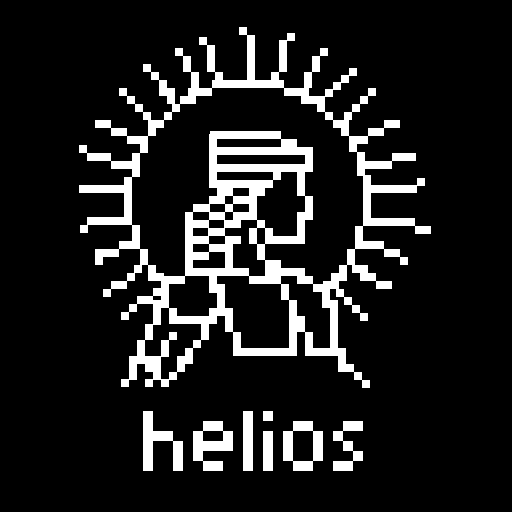

[](https://github.com/thorstensuckow/helios/actions/workflows/tests.yml)

# helios



**helios** is a custom game framework built from first principles, written in modern C++23.

## Prerequisites

Before building helios, ensure your system meets the required software prerequisites. See [PREREQUISITES.md](docs/PREREQUISITES.md) for detailed installation instructions for your platform.

**Quick Summary:**
- **CMake** 4.0+
- **C++23-capable compiler** (MSVC 2022, GCC 13+, Clang 17+)
- **OpenGL 4.5+** support
- **Ninja** or **Make** (optional but recommended)

## Quick Start

```bash
# Clone
git clone https://github.com/thorstensuckow/helios.git
cd helios

# Configure
cmake -S . -B build

# Build
cmake --build build --config Release

# Run an example
cd build/examples/scoring_demo/Release
./scoring_demo
```

## Features

- C++23 module-based architecture (`.ixx` interface units)
- SparseSet-based Entity-Component-System with versioned handles and type-erased systems
- Hierarchical scene graph with selective transform inheritance
- Phase-based game loop (`Pre` / `Main` / `Post`) with typed passes and double-buffered event buses
- Compile-time typed command buffer and handler routing
- Type-indexed resource registry for managers, command buffers, and handlers
- Template-based state management (`GameState`, `MatchState`) with transition guards
- Object pooling with prefab cloning via component reflection
- Spawn scheduling with configurable profiles, rules, and placers
- Grid-based collision detection with layers and masks
- Health, damage, scoring, timer, and lives systems
- OpenGL 4.5+ rendering backend with shader and material system
- FreeType-based text rendering
- UI system with menus, anchored transforms, and text components
- ImGui debug overlay (FPS, camera, gamepad, logging, state visualization)
- Fluent builder APIs for game object and spawn configuration
- Strongly-typed identifiers (`StrongId<Tag>`) with FNV-1a hashing
- Developed and tested on Windows (MSVC 2022); Linux and macOS are untested

## About

helios is an educational project to explore the intricacies of game engine architecture. Each component is built from first principles: the primary goal is to apply and analyze modern software engineering in a performance-critical domain while implementing the mathematical building blocks of 2D and 3D graphics.

The framework uses a modern **C++23** module-based architecture (`.ixx` interface units), providing a clean and robust dependency graph for fast compilation. External dependencies are fetched via CMake `FetchContent` (GLFW 3.4, GLAD 2.0.8, FreeType 2.14.1, Dear ImGui).

The initial rendering backend is implemented using **OpenGL 4.6**.

> **Note:** If the build fails due to compiler or CMake version issues, refer to [PREREQUISITES.md](docs/PREREQUISITES.md).

### Development Philosophy

The development process emphasizes understanding both the mathematical foundations and the rationale behind established patterns, such as trade-offs between indirect and direct data storage, the division of labor between CPU-side culling and GPU-side clipping, or the performance characteristics of SparseSet-based ECS versus inheritance-based designs.

### Academic Context

This project originated as a semester project for a computer science degree. The design principles, architecture, and prototypical implementation for the [first milestone](https://github.com/ThorstenSuckow/helios/milestone/1) are documented in the following technical report:

- **[Suc25]** Suckow-Homberg, Thorsten: *helios: Design and prototypical implementation of a C++ game framework* (2025), [ResearchGate](https://www.researchgate.net/publication/397445662_helios_Design_and_prototypical_implementation_of_a_C_game_framework)

### Directory Layout

```
.
├── benchmarks/          # Performance benchmarks for selected modules
├── docs/                # Documentation and core-concepts guides
│   └── core-concepts/   # Architectural documentation (ECS, commands, state, ...)
├── examples/            # Example applications (9 demos)
├── include/
│   ├── ext/             # Platform extensions (GLFW, OpenGL, ImGui)
│   └── helios/          # Framework module interface units (.ixx)
├── tests/               # Unit tests (Google Test / CTest)
└── website/             # Docusaurus project website
```

## Building from Source

### Prerequisites

- **C++23 compatible compiler**:
  - MSVC 19.38+ (Visual Studio 2022)
  - GCC 13.2+
  - Clang 17+
- **CMake 4.0+**
- **Git**

### Windows (Visual Studio)

```powershell
# Configure
cmake -S . -B build -G "Visual Studio 17 2022" -A x64

# Build
cmake --build build --config Release

# Run tests
cd build
ctest -C Release --output-on-failure
```

### Linux / macOS

> **Note:** helios has only been tested on Windows with MSVC 2022. The commands below are provided for reference but are untested.

```bash
# Configure
cmake -S . -B build -DCMAKE_BUILD_TYPE=Release

# Build
cmake --build build

# Run tests
cd build
ctest --output-on-failure
```

### Build Options

| Option | Description |
|--------|-------------|
| `-DCMAKE_BUILD_TYPE=Debug` | Build with debug symbols |
| `-DCMAKE_BUILD_TYPE=Release` | Build optimized release version |
| `-DBUILD_TESTING=OFF` | Disable test targets |
| `-DBUILD_EXAMPLES=OFF` | Disable example targets |
| `-DBUILD_BENCHMARKS=OFF` | Disable benchmark targets |

## Running Examples

After building, example executables are located in:
```
build/examples/<example_name>/Release/
```

Available examples:

| # | Example | Description | Guide |
|---|---------|-------------|-------|
| 1 | **simple_cube_rendering** | Rotating wireframe cube -- core rendering concepts | [Tutorial](examples/simple_cube_rendering/README.md) |
| 2 | **game_controller_input** | Gamepad input handling | [Tutorial](examples/game_controller_input/README.md) |
| 3 | **spaceship_control** | Game loop, command pattern, ImGui overlay, camera follow | [Tutorial](examples/spaceship_control/README.md) |
| 4 | **spaceship_shooting** | Twin-stick shooter with bullet pooling and aiming | [Tutorial](examples/spaceship_shooting/README.md) |
| 5 | **enemy_spawn** | Timed spawning with object pooling and random placement | [Tutorial](examples/enemy_spawn/README.md) |
| 6 | **collision_detection** | Grid-based spatial partitioning and collision events | [Tutorial](examples/collision_detection/README.md) |
| 7 | **render_text_demo** | FreeType-based text rendering with orthographic projection | [Tutorial](examples/render_text_demo/README.md) |
| 8 | **scoring_demo** | Full scoring, health, timer, state management, and UI pipeline | [Tutorial](examples/scoring_demo/README.md) |
| 9 | **runtime_test** | Interactive stress test -- object count vs. FPS measurement | [Tutorial](examples/runtime_test/README.md) |

## Documentation

### Guides

- **[API Documentation](docs/heliosapi.md)** -- Overview of the helios framework and module structure
- **[Examples](examples/README.md)** -- Tutorials and code samples for all 9 example applications
- **[Testing](docs/testing.md)** -- Running tests, debugging failures, test patterns
- **[Coding Style Guide](docs/styleguide.md)** -- C++ coding conventions and module structure
- **[Doxygen Style Guide](docs/doxygen-style.md)** -- Documentation standards
- **[Contributing Guide](docs/CONTRIBUTING.md)** -- How to contribute, commit conventions
- **[Issue Submission Guide](docs/issue_submission_guide.md)** -- Guidelines for bug reports, feature requests, and refactoring proposals
- **[Changelog](CHANGELOG.md)** -- Chronological list of notable changes

### Core Concepts

Architectural documentation for the major subsystems:

| Topic | Description |
|-------|-------------|
| [ECS Architecture](docs/core-concepts/ecs/README.md) | Entity-Component-System overview (EntityHandle, EntityManager, SparseSet, View, System) |
| [Component System](docs/core-concepts/component-system.md) | Composition-based entity design |
| [Component Lifecycle](docs/core-concepts/component-lifecycle.md) | Lifecycle hooks: onAcquire, onRelease, enable/disable, cloning |
| [Component Registry](docs/core-concepts/component-registry.md) | Modular component registration and bootstrap |
| [Game Loop Architecture](docs/core-concepts/gameloop-architecture.md) | Phases, passes, commit points, and event propagation |
| [Command System](docs/core-concepts/command-system.md) | Compile-time typed command buffering and handler routing |
| [Event System](docs/core-concepts/event-system.md) | Double-buffered event buses with phase/pass propagation |
| [Resource Registry](docs/core-concepts/resource-registry.md) | Type-indexed O(1) service locator |
| [State Management](docs/core-concepts/state-management.md) | GameState / MatchState hierarchical state machines |
| [Spawn System](docs/core-concepts/spawn-system.md) | Spawn scheduling, profiles, and builder DSL |
| [Object Pooling](docs/core-concepts/object-pooling.md) | Prefab-based entity recycling |
| [Sparse Set](docs/core-concepts/sparse-set.md) | O(1) component storage data structure |
| [Text Rendering](docs/core-concepts/text-rendering.md) | FreeType glyph rendering pipeline |
| [Scene Graph](docs/core-concepts/scene-graph.md) | Hierarchical scene organization with transform inheritance |
| [GameObject Builder](docs/core-concepts/gameobject-builder.md) | Fluent builder pattern for entity construction |
| [Conventions](docs/core-concepts/conventions.md) | Coordinate systems, matrix storage, units |

### Generating API Documentation

```bash
external/doxygen/doxygen.exe docs/Doxyfile.in
```

The generated HTML documentation will be available in `docs/api/html/`.

## Contributing

Please read our [Contributing Guide](docs/CONTRIBUTING.md) and [Issue Submission Guide](docs/issue_submission_guide.md) for details on:

- Commit conventions (Conventional Commits)
- Code style requirements
- Pull request process
- Testing guidelines
- Submitting bug reports, feature requests, and refactoring proposals

### Quick Contribution Guidelines

- Follow [Conventional Commits](https://www.conventionalcommits.org/):
  - `feat:` for new features
  - `fix:` for bug fixes
  - `refactor:` for code improvements
  - Use `!` for breaking changes (e.g., `feat!:`)
- Write tests for new features
- Update documentation
- Run `clang-format` before committing

## License

This project is licensed under the **MIT License**. See [LICENSE](LICENSE) file for details.

## Community & Support

- **[Discussions](https://github.com/thorstensuckow/helios/discussions)** -- Ask questions, share ideas
- **[Issues](https://github.com/thorstensuckow/helios/issues)** -- Report bugs or request features
- **Contact**: [thorsten@suckow-homberg.de](mailto:thorsten@suckow-homberg.de)

## Project Status

**Active Development** -- helios is an educational project under active development. The project has progressed through **5 milestones**:

| Milestone | Status | Description |
|-----------|--------|-------------|
| [1](https://github.com/thorstensuckow/helios/milestone/1) | Complete | Application layer, event system, input, rendering pipeline |
| [2](https://github.com/thorstensuckow/helios/milestone/2) | Complete | Camera refactor, ImGui tooling, frame pacing, scene graph |
| [3](https://github.com/thorstensuckow/helios/milestone/3) | Complete | Physics, collision detection, shooting mechanics, ECS components |
| [4](https://github.com/thorstensuckow/helios/milestone/4) | Complete | Game loop architecture, spawn system, object pooling, modular reorganization |
| [5](https://github.com/thorstensuckow/helios/milestone/5) | Complete | SparseSet ECS refactor, ResourceRegistry, typed commands, state management, scoring, health, text rendering, UI |

APIs may change as the framework evolves. See [CHANGELOG.md](CHANGELOG.md) for migration guides on breaking changes.

## Acknowledgments

This project is inspired by and builds upon concepts from industry-standard game engines and graphics frameworks. Special thanks to the authors of the referenced literature below.

## Bibliography

- **[Vri20]** de Vries, Joey: *Learn OpenGL* (2020), Kendall & Wells
- **[RTR]** Akenine-Möller, Tomas; Haines, Eric; Hoffman, Naty: *Real-Time Rendering, 4th ed.* (2018), A. K. Peters, Ltd.
- **[Gre19]** Gregory, Jason: *Game Engine Architecture, 3rd ed.* (2018), A K Peters/CRC Press
- **[She07]** Sherrod, Allen: *Data Structures and Algorithms for Game Developers* (2007), Charles River Media
- **[HDMS+14]** Hughes, John F. et al.: *Computer Graphics - Principles and Practice, 3rd ed.* (2014), Addison-Wesley
- **[KSS17]** Kessenich, John; Sellers, Graham; Shreiner, Dave: *The OpenGL Programming Guide, 9th ed.* (2017), Addison Wesley
- **[Str22]** Stroustrup, Bjarne: *A Tour of C++, 3rd ed.* (2022), Addison-Wesley
- **[PJH23]** Pharr, Matt; Jakob, Wenzel; Humphreys, Greg: *Physically Based Rendering, 4th ed.* (2023), MIT Press
- **[DP11]** Dunn, Fletcher; Parberry, Ian: *3D Math Primer for Graphics and Game Development, 2nd ed.* (2011), CRC Press
- **[Gla95]** Glassner, Andrew S. (ed.): Graphics Gems. AP Professional / Academic Press, Boston, 1995.
- **[Len16]** Lengyel, Eric: Foundations of Game Engine Development (2016), Terathon Software LCC
- **[Eri05]** Ericson, Christer: Real-Time Collision Detection (2005), CRC Press
- **[HS99]** Havran, Vlastimil and Sixta, Filip: Comparison of Hierarchical Grids (1999), https://www.realtimerendering.com/resources/RTNews/html//rtnv12n1.html#art3
- **[Rey99]** Reynolds, Craig W.: Steering Behaviors for Autonomous Characters (1999), https://www.red3d.com/cwr/papers/1999/gdc99steer.pdf

